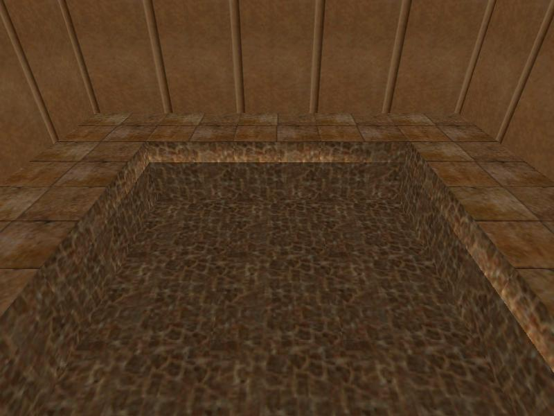

<!DOCTYPE html>
<html>
<head>
<meta charset="utf-8">
<link rel="stylesheet" href="normalize.css">
<link rel="stylesheet" href="style.css">
<title>User Manual</title>
</head>
<body>

Vertex shader patch\
User Manual
====================

## Overview

This patch allows the level builder to dinamically override lighting effects.

## Black shadows

If you want nice black shadows in water rooms and nothing more, just create a rule with these contents:

```
Level:                 -1
Condition:             -1
Subject type:           2
Subject description 1:  1
Subject description 2: -1
Blend mode 1:           1
Colour 1:               <read below>
Blend mode 2:          -1
Colour 2:               0,0,0
Operation:              2
```

Colour 1 is the only parameter that you have to adjust.
Start with white and progressively make it darker, producing shades of grey.
You will notice that the caustics strength is proportional to the colour brightness.
Setting it to black will effectively remove all caustics.

1) [](images/shadow/no.jpg)
   Unpatched

2) [](images/shadow/255.jpg)
   Colour 1: 255,255,255

3) [](images/shadow/127.jpg)
   Colour 1: 127,127,127

4) [](images/shadow/0.jpg)
   Colour 1: 0,0,0

## Definitions

The interface provided by this patch is based on rules.
A rule is a complete and independent declaration of commands and their prerequisites.
They are called respectively actions and constraints.

This patch exposes 64 rules, which are processed sequentially before each lighting effect calculation.
The goal is to find a matching rule, that is, a rule whose constraints are satisfied.
The first matching rule found has its actions executed and further rules are skipped.
Otherwise, if there is no matching rule, the lighting effect stays the same.

## Syntax

The rule syntax is composed of several numeric fields.
All fields have allowed values, specified in a list containing numbers and inclusive ranges.
Values that are not in the list result in undefined behaviour.

### Level

This constraint is satisfied if the number of the level being played is this value.
It is satisfied for all levels if this value is Universe.

> Allowed values:
>
> + -1
>
>   Universe
>
> + 0
>
>   Title
>
> + 1-127
>
>   Number of the level

### Condition

This field has different purposes depending on the patch flavour.

**Patch flavour: FLEP**

This constraint is satisfied if the condition inside the TriggerGroup ID of this value returns true.
It is always satisfied if this value is Universe.

> Allowed values:
>
> + -1
>
>   Universe
>
> + 1-9999
>
>   TriggerGroup ID

*During level loading this constraint is satisfied only if this value is Universe.*

**Patch flavour: TREP**

This constraint is satisfied if the custom flipeffect of this value returns true.
It is always satisfied if this value is Universe.

> Allowed values:
>
> + -1
>
>   Universe
>
> + 47-558
>
>   Custom flipeffect

*During level loading this constraint is satisfied only if this value is Universe.*

### Subject type

This constraint is satisfied if the type of the lighting effect being calculated is this value.

> Allowed values:
>
> + 1
>
>   Lighting cast on rooms by ambient and placed lights
>
> + 2
>
>   Lighting cast on rooms by caustics
>
> + 3
>
>   Lighting cast on objects by ambient, placed and dynamic lights
>
> + 4
>
>   Lighting cast on statics by its internal lighting

### Subject description 1

This field has different purposes depending on the value of Subject type.

**Subject type: 1 or 2**

This constraint is satisfied if the room has a flag of this value.
It is satisfied for all rooms if this value is Universe.

> Allowed values:
>
> + -1
>
>   Universe
>
> + 1
>
>   Water
>
> + 4
>
>   Quicksand
>
> + 16
>
>   Damage
>
> + 32
>
>   Outside
>
> + 128
>
>   No lens flare
>
> + 256
>
>   Mist
>
> + 512
>
>   Reflection
>
> + 1024
>
>   Snow
>
> + 2048
>
>   Rain

**Subject type: 3**

This constraint is satisfied if the object slot is this value.
It is satisfied for all objects if this value is Universe.

> Allowed values:
>
> + -1
>
>   Universe
>
> + 0-519
>
>   Object slot

**Subject type: 4**

This constraint is satisfied if the static slot is this value.
It is satisfied for all statics if this value is Universe.

> Allowed values:
>
> + -1
>
>   Universe
>
> + 0-159
>
>   Static slot

*This constraint is satisfied no matter if the static is shattered or not.*

### Subject description 2

This field has different purposes depending on the value of Subject type.

**Subject type: 1 or 2**

This constraint is satisfied if the in-game room number is this value.
It is satisfied for all rooms if this value is Universe.

> Allowed values:
>
> + -1
>
>   Universe
>
> + 0-511
>
>   In-game room number

*This constraint is satisfied no matter if the room is flipped or not.*

**Subject type: 3**

This constraint is satisfied if the mesh ID of the object is this value.
It is satisfied for all meshes if this value is Universe.

> Allowed values:
>
> + -1
>
>   Universe
>
> + 0-31
>
>   Mesh ID of the object

*This constraint is satisfied no matter if the mesh is normal or swapped, if it is shattered or not, or if the object was exploded.*

**Subject type: 4**

> Allowed values:
>
> This field is unused.

### Blend mode 1

When this action is executed, the lighting colour and Colour 1 are blended with the blend mode of this value.
Nothing is done if this value is None.

> Allowed values:
>
> + -1
>
>   None
>
> + 1
>
>   Multiply
>
> + 2
>
>   Screen
>
> + 3
>
>   Darken
>
> + 4
>
>   Lighten
>
> + 5
>
>   Difference

### Colour 1

> Allowed values:
>
> + 0-255
>
>   Colour component magnitude

### Blend mode 2

When this action is executed, the modified lighting colour (lighting colour blended with Colour 1) and Colour 2 are blended with the blend mode of this value.
Nothing is done if this value is None.

> Allowed values:
>
> Same as Blend mode 1.

### Colour 2

> Allowed values:
>
> Same as Colour 1.

### Operation

This field has different purposes depending on the value of Subject type.

**Subject type: 1, 3 or 4**

> Allowed values:
>
> This field is unused.

**Subject type: 2**

When this action is executed, the lighting cast on rooms by caustics is combined with the lighting cast on rooms using the operation of this value.
Nothing is done if this value is None.

> Allowed values:
>
> + -1
>
>   None
>
> + 1
>
>   Addition
>
> + 2
>
>   Subtraction

## Blending

You can read more about blending here: [https://www.w3.org/TR/compositing-1/#blending](https://www.w3.org/TR/compositing-1/#blending).

## Limitations

The lighting cast on objects in the inventory or in pickup notifications cannot be overridden.

This patch prevents changes in the lighting cast on rooms by dynamic lights.
Isolated changes in the lighting cast on objects by dynamic lights are prevented too.

## Examples

The following examples illustrate some uses of this patch.

### Example 1

`Make the skeleton head redish.`

One possible solution is to create a rule with these contents:

```
Level:                 -1
Condition:             -1
Subject type:           3
Subject description 1:  35
Subject description 2:  9
Blend mode 1:           2
Colour 1:               192,0,0
Blend mode 2:           1
Colour 2:               135,135,135
Operation:              0
```

1) [](images/1/shot000.jpg)
   Red-headed skeleton

2) [](images/1/shot001.jpg)
   Head shattering

3) [](images/1/shot002.jpg)
   Skeleton blowing up

### Example 2

`Make SHATTER0 glow with yellow light if Lara is drawing guns and if it is the first level.`

There are different procedures depending on the patch flavour.

**Patch flavour: FLEP**

One possible solution is to create a rule with these contents:

```
Level:                  1
Condition:              1000
Subject type:           4
Subject description 1:  50
Subject description 2:  0
Blend mode 1:           4
Colour 1:               255,255,0
Blend mode 2:           1
Colour 2:               55,55,55
Operation:              0
```

Open script.txt and type these contents inside the [Level] section of the first level:

```
; Set Trigger Type - FLIPEFFECT 244
; Exporting: TRIGGER(1279:0) for FLIPEFFECT(244) {Tomb_NextGeneration}
; <#> : Variables. Memory. Copy to <&>Numeric Variable the (E)Savegame Memory value
; <&> : Current Value
; (E) : Lara. Hands. Attached Lara Status (Short)
; Values to add in script command: $2000, 244, $4FF

; Set Trigger Type - CONDITION 48
; Exporting: CONDITION(48:0) for PARAMETER(4) {Tomb_NextGeneration}
; <#> : Value=     4
; <&> : Variables. The Current Value variable is = than <#>Value
; (E) :
; Values to add in script command: $8000, 4, $30

TriggerGroup=	1000,$2000,244,$4FF,$8000,4,$30
```

**Patch flavour: TREP**

One possible solution is to create a rule with these contents:

```
Level:                  1
Condition:              50
Subject type:           4
Subject description 1:  50
Subject description 2:  0
Blend mode 1:           4
Colour 1:               255,255,0
Blend mode 2:           1
Colour 2:               55,55,55
Operation:              0
```

Open Flipeffect editor, select the custom flipeffect 50 and type these contents:

```
IF_CARRY_GUNS
RETURN_TRUE
```

1) [](images/2/shot000.jpg)
   Lara

2) [](images/2/shot001.jpg)
   Lara and her guns

3) [](images/2/shot002.jpg)
   SHATTER0 shattering

### Example 3

`Make the reflections of room 112 of the seventh level greenish and make the underwater reflections of room 10 of the same level coloured with shades of pink and green.`

One possible solution is to create rules with these contents:

```
Level:                  7
Condition:             -1
Subject type:           2
Subject description 1: -1
Subject description 2:  112
Blend mode 1:           3
Colour 1:               0,255,0
Blend mode 2:           2
Colour 2:               25,25,25
Operation:              1
```

```
Level:                  7
Condition:             -1
Subject type:           2
Subject description 1: -1
Subject description 2:  10
Blend mode 1:           5
Colour 1:               64,0,64
Blend mode 2:           2
Colour 2:               15,15,15
Operation:              1
```

1) [](images/3/shot000.jpg)
   Colourful pool

2) [](images/3/shot001.jpg)
   Colourful pool again

</body>
</html>
